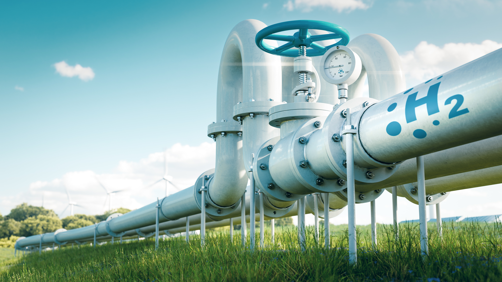

# 💨🛠️ A Testbed Dataset for Anomaly Detection in Hydrogen Transport Networks

This repository provides the simulation framework and baseline models developed in support of the paper _“A Testbed Dataset for Anomaly Detection in Hydrogen Transport Networks”_, which addresses the technical and safety challenges of transporting hydrogen through existing gas pipeline infrastructure.

## 🌍 Motivation

Hydrogen is a zero-emission energy carrier with the potential to decarbonize critical sectors such as transportation, power generation, and heavy industry. However, adapting existing **natural gas networks** for hydrogen or hydrogen blends introduces significant challenges:

- Hydrogen molecules are **smaller and lighter** than methane, leading to increased permeability and higher risk of **leaks**, especially at **joints, valves, and welds**.
- **Hydrogen embrittlement** weakens metallic components, increasing the likelihood of failure.
- Conventional sensors and instruments (e.g., flow meters, pressure gauges) calibrated for natural gas may provide **inaccurate readings** with hydrogen blends.
- **Compression and pressure reduction stations** may not handle hydrogen’s distinct thermodynamic behavior effectively.

These limitations necessitate new **monitoring, simulation, and anomaly detection systems** to ensure safe and efficient hydrogen transport.


## 🧠 The Digital Twin Approach

We simulate a hydrogen pipeline system using **MATLAB Simscape**, generating multivariate time series from pressure sensors. This Digital Twin enables:

- Accurate modeling of **transient and steady-state dynamics**.
- Injection of various **anomalous scenarios**: leaks, compressor failures, delayed responses.
- Evaluation of **anomaly detection models** under realistic, high-variability conditions.

## 📊 Dataset Features

The synthetic dataset includes:

- **Normal operation**: pressure stabilizes after a transient regime.
- **Anomalies**: compressor faults, local restrictions (valve closures), delayed pressure recovery.
- **Sensor noise**: optional Gaussian noise added to simulate measurement errors.
- **Labels**: for normal and anomalous intervals.

## 🧪 Baseline Experiments

As an initial benchmark, we evaluated several standard anomaly detection methods:

- **Isolation Forest**
- **One-Class SVM**
- **Local Outlier Factor (LOF)**
- **Elliptic Envelope**
- **Minimum Covariance Determinant (MCD)**
- **k-Nearest Neighbors (kNN)**

These models were tested under both clean and noisy conditions. Results show that many algorithms struggle to detect subtle, asynchronous deviations caused by anomalies — particularly in the presence of transient regimes and noise.

This highlights the need for **more robust learning approaches** tailored to the unique characteristics of hydrogen network dynamics.

## 📁 Repository Structure
```bash
.
enea_h2net_v1/
│
├── anomaly_detection_classifiers/ # Classical baseline models (v1)
├── jupyter/ # Notebooks for visualization and analysis
├── time_series_plot/ # Time series plotting utilities
├── utils/ # Common utility functions
├── anomaly_detection_hydrogen_network_pressure_sensors.py
└── output.txt # Example output logs

enea_h2net_v2/
│
├── LSTM_ad.ipynb # LSTM-based anomaly detection (deep learning)
├── anomaly_detection.ipynb # Model comparison and evaluation
├── anomaly_labeling_and_noise_simulation.ipynb
├── results/ # Output results
└── hydrogen-station.jpg # Schematic illustration`
```
## 🚀 Getting Started

Clone the repository:

```bash
git clone https://github.com/andysinx/HQ-FHLRE.git
cd HQ-FHLRE
pip install -r requirements.txt
```

Run the Jupyter notebooks or scripts in the respective folders to reproduce the experiments.

⚠️ Data Disclaimer
The dataset is not publicly released.
It is part of an industrial Ph.D. project in collaboration with ENEA and is protected under confidentiality agreements. Only metadata and architecture descriptions are made available.

👨‍🔬 Project Context
This work is part of the Industrial Ph.D. program in Computational Intelligence at the University of Naples Federico II, funded by ENEA. It focuses on the development of advanced anomaly detection methods for critical energy infrastructures.


