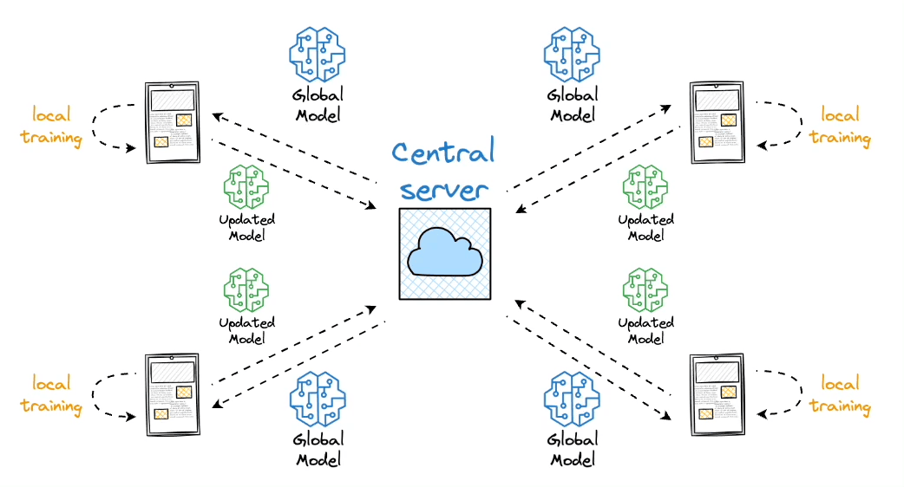

# ⚛️🤖🧠  HQ-FHLRE: Hybrid-Quantum Federated Hydrogen Leak Recognition Engine 🖥️🌐

This repository contains experiments from my Industrial Ph.D. project in Computational Intelligence at UniNa (scholarship funded by ENEA), focused on anomaly detection in hydrogen transport networks.

We simulate a hydrogen pipeline system using **Simscape**, collecting multivariate time series from **four pressure sensors**. The dataset includes:
- A **normal operating scenario**, in which the pressure stabilizes after an initial transient.
- **Three anomalous scenarios**: local restrictions, valve closures, and compressor failures.

Anomalies manifest as subtle, asynchronous perturbations across the sensor time series—making this a challenging **multivariate anomaly detection** task.


**QFADH** (Quantum Federated Anomaly Detection for Hydrogen) is the experimental framework in which we apply:
1. **Local training** of anomaly detection models on each simulated scenario.
2. **Federated learning**, where models trained locally share only parameters—not data—preserving privacy and enabling **decentralized intelligence**.

### ✨ Models used (deployed both locally and in federated setting):
- **LSTM Autoencoder** – classical deep learning baseline.
- **QLSTM** – LSTM augmented with hybrid quantum-classical gates.
- **QTLSTM** – Classical LSTM trained using parameters generated from quantum circuits (Quantum Train approach).

---

This pipeline allows us to compare classical and quantum-enhanced architectures, first in an isolated (local) setting, then within a federated learning framework, providing insight into:
- How quantum models perform on sparse, multivariate anomalies.
- How federated learning impacts generalization and robustness.

<div align="center">

  
  
  
  <br><br>
  
  
  

</div>

---

## 📁 Project Structure

```QFAD/
├── Data_train/
│ ├── 0/
│ ├── 0_pp/
│ ├── 1/
│ ├── 1_pp/
│ ├── 2/
│ ├── 2_pp/
│ ├── 3/
│ └── 3_pp/
├── Data_train_plots/
│ ├── 0/
│ ├── 0_preproc/
│ ├── 1/
│ ├── 1_preproc/
│ ├── 2/
│ ├── 2_preproc/
│ ├── 3/
│ └── 3_preproc/
├── model_train_saved/
│ ├── lstm_autoencoder_model.pth
│ ├── quantum_lstm_autoencoder.pth
│ └── quantumtr_lstm_autoencoder.pth
├── 000586C5-inquinamento.jpg
├── README.md
├── clean_dataset.ipynb
├── federated-gif.gif
├── quantum lst.png
├── quantum_training_LSTM.ipynb
├── training_classical_LSTM.ipynb
├── requirements.txt
├── training_classical_LSTM.ipynb
├── training_models.ipynb
└── training_quantum_LSTM.ipynb
``` 
---

## 🧠 Models Overview

- **LSTM Autoencoder**: Classical baseline.
- **QLSTM**: LSTM with hybrid classical-quantum architecture.
- **QTLSTM**: Quantum train protocols for Classical LSTM.
---

## 🚀 Getting Started

1. Install the dependencies:
   ```bash
   pip install -r requirements.txt
   ```


